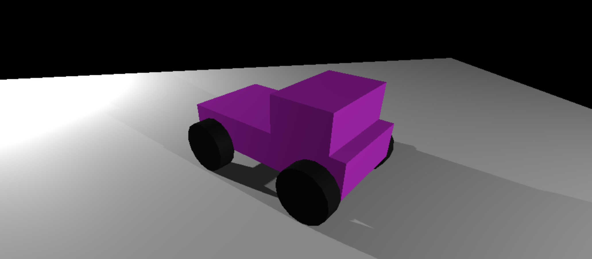

# ThreeJS Ca

## About

In this project, the goal was to implement a drivable 4-wheel car and it's interactions with lighting and world. The code was written in vanilla JS, HTML & CSS.

## Testing It Out

This project is deployed live at rbtavares.com/threejs-car, but if you wish to test it in a local environment just clone this repository and run `npm install` followed by `npm run dev`.

